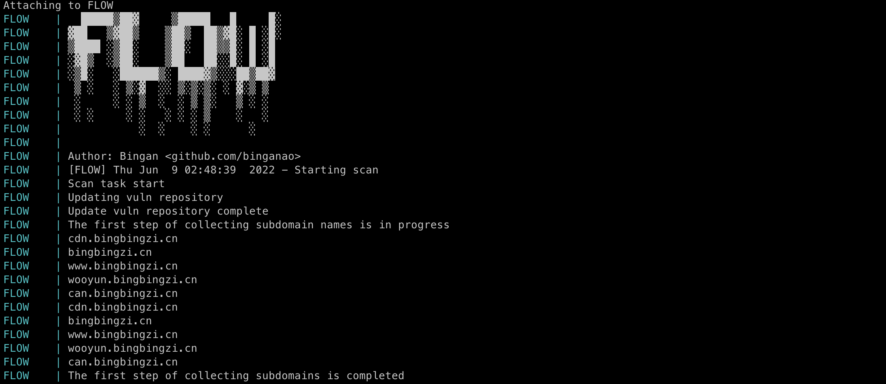

# FLOW - Automate SRC workflow

Flow 是一款基于 Docker 搭建的自动化 SRC 工作流，目前它包含了 nuclei、subfinder、naabu、httpx、notify 以及 xray，Flow 的整体工作流程为：子域名发现 -> 端口探测 -> http 服务发现 -> 漏洞扫描 -> 结果输出。Flow 能够在任务完成一小时后，重新启动任务，保持对资产的监控。

> 注：可以自行添加 xscan 开启自动化 XSS 漏洞挖掘能力



## 快速上手

```
# 克隆 Flow 到本地
git clone https://github.com/binganao/Flow.git
cd Flow

# 配置子域名发现
vim domains.txt

# 配置目标 （不进行子域名发现）
vim targets.txt

# 启动 Flow
docker-compose up
```

## 配置

Flow 默认包含了两个配置文件：`notify.yaml`、`subfinder.yaml` 

### notify

> [Notify](https://github.com/projectdiscovery/notify) is a Go-based assistance package that enables you to stream the output of several tools (or read from a file) and publish it to a variety of supported platforms.

配置文件参考（使用 tg 推送）

```
telegram:
  - id: "tel"
    telegram_api_key: ""
    telegram_chat_id: ""
    telegram_format: "{{data}}"
```

### subfinder

> [Subfinder](https://github.com/projectdiscovery/subfinder) is a subdomain discovery tool that discovers valid subdomains for websites by using passive online sources. It has a simple modular architecture and is optimized for speed. subfinder is built for doing one thing only - passive subdomain enumeration, and it does that very well.

配置文件参考

```
binaryedge: 
  - lsnflksnfklfnesklfse
censys: []
certspotter: []
chaos: []
dnsdb: []
github: []
intelx: []
passivetotal: []
robtex: []
securitytrails: []
shodan: []
spyse: []
threatbook: []
urlscan: []
virustotal: []
zoomeye: []
zoomeyeapi: []
fofa: []
fullhunt: []
```

## 自行构建

为了增加 Flow 的能力，可自行构建 Docker 镜像

```
cd Flow
# 例如 xxx/flow:0.0.6
docker build -t xxx/flow:0.0.x .
```

配置 docker-compose.yml

```
version: '2'

services:
  flow:
    image: xxx/flow:0.0.x
    container_name: FLOW
    environment:
      - 'TZ="Asia/Shanghai"'
    volumes:
      - ./targets.txt:/script/targets.txt
      - ./domains.txt:/script/domains.txt
      - ./dict/sub-dict.txt:/script/dict/sub-dict.txt
      - ./config/subfinder.yaml:/root/.config/subfinder/provider-config.yaml
      - ./config/notify.yaml:/root/.config/notify/provider-config.yaml
    command: sh -c "./auto.sh"
```

## 参考

[https://github.com/projectdiscovery/subfinder](https://github.com/projectdiscovery/subfinder)

[https://github.com/projectdiscovery/nuclei](https://github.com/projectdiscovery/nuclei)

[https://github.com/projectdiscovery/naabu](https://github.com/projectdiscovery/naabu)

[https://github.com/projectdiscovery/httpx](https://github.com/projectdiscovery/httpx)

[https://github.com/projectdiscovery/notify](https://github.com/projectdiscovery/notify)

https://github.com/chaitin/xray
